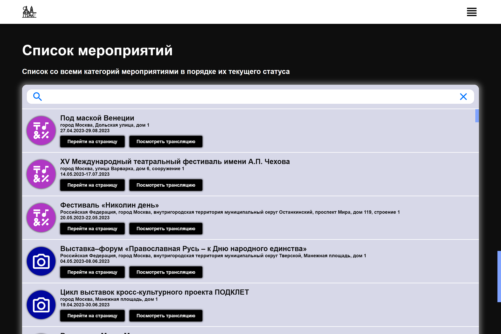
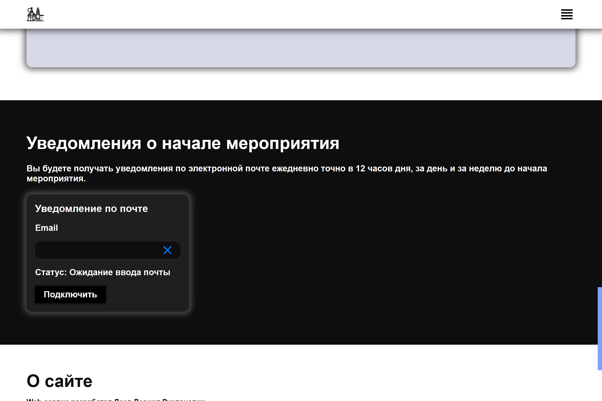

# Actual Moscow Events

## Описание
Проект разработан со следующими целями:
- простой и в тоже хороший дизайн
- отображение мероприятий на карте
- трансляции мероприятий и их запись
- уведомления по почте
- информация о мероприятиях
- единые и актуальные данные за счёт сервера
- адаптив для мобильных и планшетных устройств

Нереализованные цели (ветка Future)
- личный кабинет (Недостаточно было времени, особенно на реализацию и тестирование серверной части)
- уведомления по SMS (Платная услуга)
- уведомления на сайте (требуется личный кабинет)

## Скриншоты

Скриншот встречающей секции главного

Скриншот таблицы категорий мероприятий

Скриншот карты всех мероприятий

Скриншот списка всех мероприятий

Скриншот встречающей секции художественных мероприятий

Скриншот встречающей секции одного из мероприятий

Скриншот описания одного из мероприятий

Скриншот мероприятия на карта

Скриншот секции с прямой трансляции мероприятия

Скриншот секции с возможностью создания автоматических уведомлений по почте (реализовано только на клиенте)

## Инструкция по установке для Windows 10/11 ,консоль Git Bash

1. Установить/обновить стабильную версию node.js (Версия разработчика: v18.16.0, узнать вашу версию можно при помощи команды `node -v`, скачать node.js можно на официальном сайте `https://nodejs.org/ru`)
2. Установить/обновить npm (Версия разработчика: v9.6.2, узнать вашу версию можно при помощи команды `npm -v`, npm устанавливается вместе с node.js(смотреть 1 пункт), обновить версию npm можно при помощи команды `npm update npm -g`)
3. Создать 2 пустые папки на своём компьютере
4. Скачать в первую папку копию удалённого репозитория при помощи команды `git clone https://github.com/Midnight-Knight/rtu_it_lab_project.git`
5. Скачать во вторую папку копию сервера репозитория при помощи команды `git clone https://github.com/Midnight-Knight/server_rtu_it_lab.git`

# ИНСТРУКЦИЯ

## Инструкция по подготовке к запуску Frontend части

1. После установки,в консоли перейдите в директорию папки с клоном репозитория клиент части `cd ./путь`
2. Пропишите следующую команду для установки всех нужных модулей: `npm i --force`

#### ВНИМАНИЕ
Для полноценной работы необходимо использовать веб-сервис и сервер на локальной машине.
Ссылка на backend репозиторий `https://github.com/Midnight-Knight/server_rtu_it_lab`

## Инструкция по подготовке к запуску Backend части

1. После установки,в консоли перейдите в директорию папки с клоном репозитория серверной части `cd ./путь`
2. Пропишите следующую команду для установки всех нужных модулей: `npm i --force`

## Инструкция по запуску приложения

#### Для дальнейшей работы вам понадобиться две консоли или переводить серверный процесс в фон, чтобы можно было запустить клиент(рекомендуется использовать 2 консоли)

1. Откройте консоль номер 1
2. В консоли перейдите в директорию папки с серверной частью `cd ./путь`
3. Введите следующую команду в консоли, для запуска сервера web-приложения в локальной сети: `npm start` (Сервер будет размещён по адресу `http://localhost:2999` или на `http://0.0.0.0:2999`)
4. Откройте консоль номер 2
5. В консоли перейдите в директорию папки с клиентской частью `cd ./путь`
6. Введите следующую команду в консоли, для запуска клиента web-приложения в локальной сети: `npm start` (Сайт будет размещён по адресу `http://localhost:3000` или на `http://0.0.0.0:3000`)
